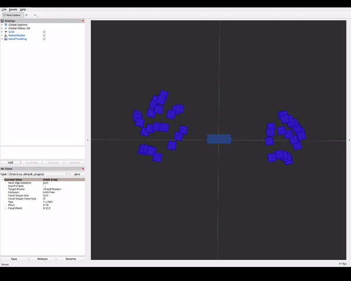
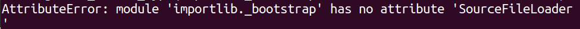
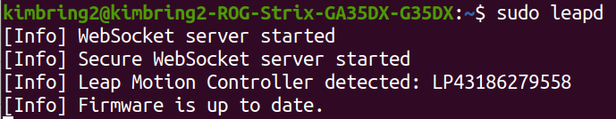
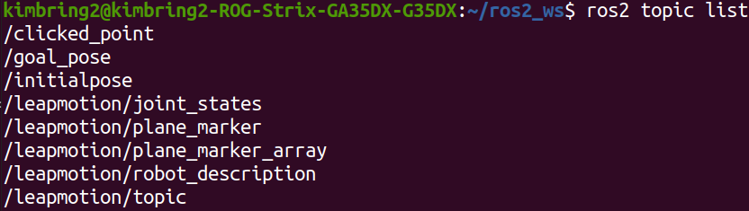
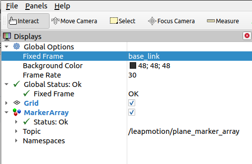

# Introduction
This package lets you use the Leap Motion optical hand tracking module with ROS2. It provides access to the following data:
- Fingers, bones position for the left, and right hand.



# Known issues
- This package only works for the two hand tracking. One hand case is ignored.
- This package is not official and developed by myself alone. Even if I borrow the really good ROS2 format from [zed-ros2-wrapper](https://github.com/stereolabs/zed-ros2-wrapper) package, there are still lots of parts those should be fixed. The pull request is always welcome (:

# Requirements
- Ubuntu 20.04
- ROS2 Foxy

# Build the package
```
$ cd ~/ros2_ws/src/ #use your current ros2 workspace folder
$ git clone --recursive https://github.com/kimbring2/leapmotion-ros2-wrapper.git
$ cd ..
$ rosdep install --from-paths src --ignore-src -r -y
$ source install/setup.bash
$ colcon build --packages-select leapmotion_wrapper
```

# Found error and solution
AttributeError: module 'importlib._bootstrap' has no attribute 'SourceFileLoader'

```$ python3.8 -m ensurepip --upgr```

If rosdep is missing you can install it with:
```$ sudo apt-get install python-rosdep python-rosinstall-generator python-vcstool python-rosinstall build-essential```

#  Starting the Leap Motion sensor
First, you should intall the Leap Motion SDK according to this [tutorial](https://support.leapmotion.com/hc/en-us/articles/360004317918-Linux-Installation).

After installion, connect your sensor to PC and start using below command.

```
$ sudo leapd
```

You should see the log text like a a below image.



# Starting the ROS2 wrapper of Leap Motion sensor
If you succufully start the sensor, you can launch the ROS2 package to deal the hand tracking information from it.

```
$ ros2 launch leapmotion_wrapper leapmotion.launch.py
```

After starting node, you should see the below topic list.

```
$ ros2 topic list
```

The '/leapmotion/plane_marker_array' can be seen in RViz.



# Display the sensor information using Rviz2

After launching, you can see the hand tracking information using the Rviz2

First, open the Rviz2
```
$ rviz2
```

Next, set the Fixed Frame of Displays section as base_link and add the MarkerArray topic display 


